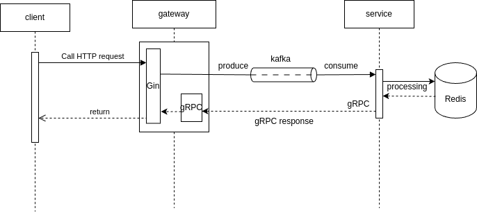

# Sale Campaigne Simulation

## Tech stack

- Golang: gRPC, Gin
- Kafka
- Redis
- Docker

## Architecture



The architecture is composed of 5 main components:

- Client : send order request to Gateway
- Gateway : receive push data into kafka and receive gRPC response from service.
- Kafka : make  sure the message will be delivered in order. It's used for communication between gateway and service.
- Service: read order from kafka, process it with redis db, send gRPC response back to Gateway
- Redis :  store the real time stock information for each item.

## Start:

```bash
docker-compose up --build -d
```

## Addition:
- Makefile is available
